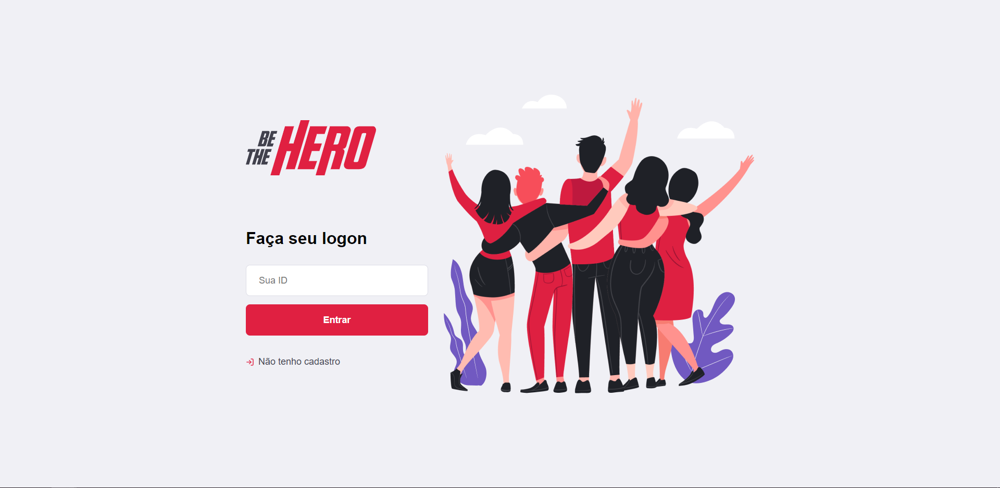
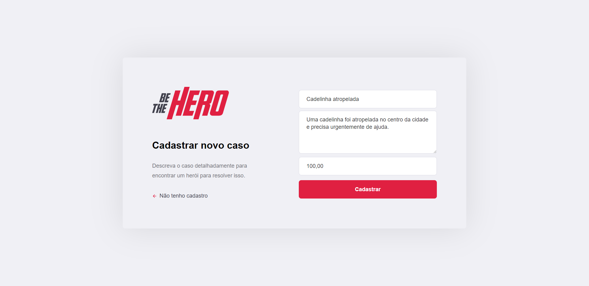
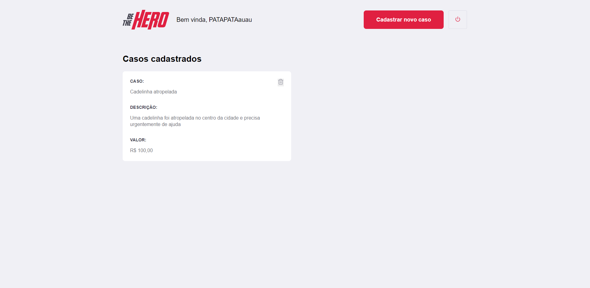

  <div align="center">
  
  <p>Support ONGs, support good causes, <strong>be a hero!</strong><p><p>

  
  
</div>

---

## 🗺️ Project
   The project connects people who are willing to help ONG's that need help wish some value to address specifc cases.

---
## 🛠 Tools

- [React](https://pt-br.reactjs.org/)
- [React Native](http://reactnative.dev/)
- [Node.js](https://nodejs.org/en/docs/)
- [Express](http://expressjs.com/)
- [Knex](http://knexjs.org/)
- [Jest](https://jestjs.io/)
- [Styled Components](https://styled-components.com/)


---

## 💻 Application Web

[Clique aqui](http://bethehero.raionenascimento.com.br/)

---
## 🚀 Quick start

### Installation

The application requires [Node.js](https://nodejs.org/) v10+ to run.

Install the dependencies and devDependencies and start the server.

Clone the repository: https://github.com/RaioneNascimento/Be_the_hero

To up backend **(always up the backend for perfect funcionality).**
```sh
$ cd backend
$ npm install
$ npm start
```

For application web

```sh
$ cd frontend
$ npm install
$ npm start
```

For application mobile
```sh
$ cd mobile
$ npm install
$ expo start
```

It's necessery a instalation application EXPO in Smartphone. 
Download Android/iOS here:
- [Expo GooglePlay](https://play.google.com/store/apps/details?id=host.exp.exponent&hl=pt)
- [Expo AppStore](https://apps.apple.com/br/app/expo-client/id982107779)

---

## 📷 ScreenShots
**WEB**
  
  
  
  
  <div align="center">
  
  
  
  
  
  </div>
  
---

## TODO
- [x] Create release 1.0.0 app
- [x] Add Styled Components
- [x] Add more tests
- [ ] Show total Heroes
- [ ] Show total collected.
---
 [Rocketseat](https://rocketseat.com.br/)
**Instructor: [Diego Fernandes](https://github.com/diego3g) | CTO RocketSeat**

`made with 💜  by raionedeveloper © 2020`
